# Joystick keyboard

A 3D-printed DIY joystick keyboard for gaming, FOSS alternative to [GMk](https://www.gamingmodkits.com/product/keyboardjoystick/2)
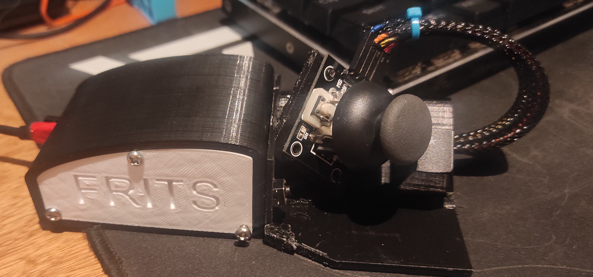
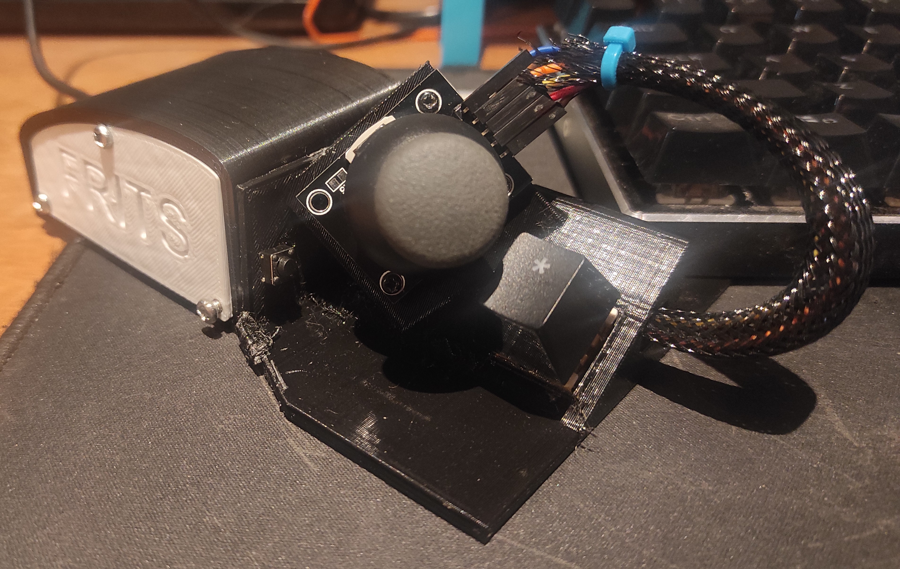
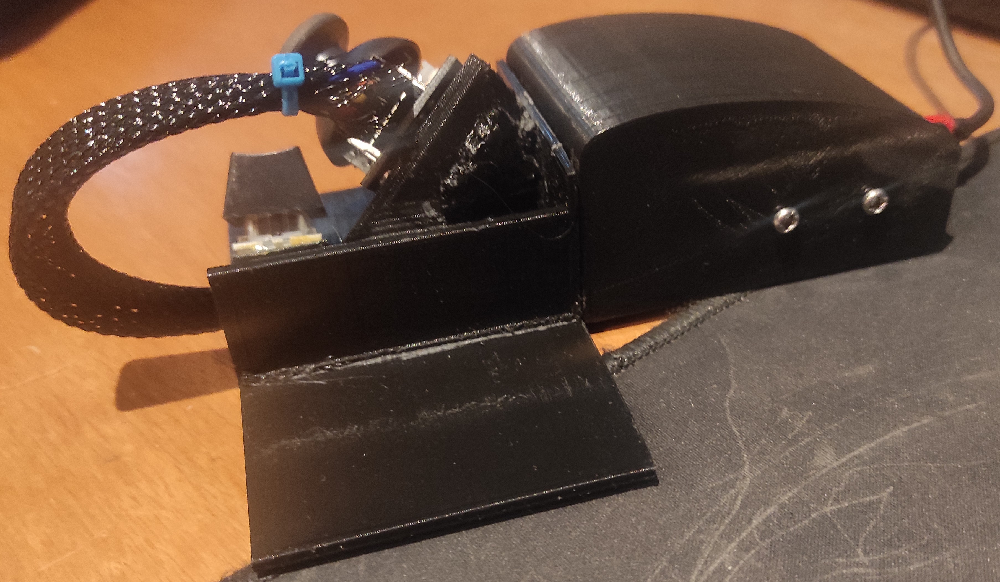

## Build

**You can find reference build photos in images/wiring**

### Hardware requirements

- Arduino Pro Micro
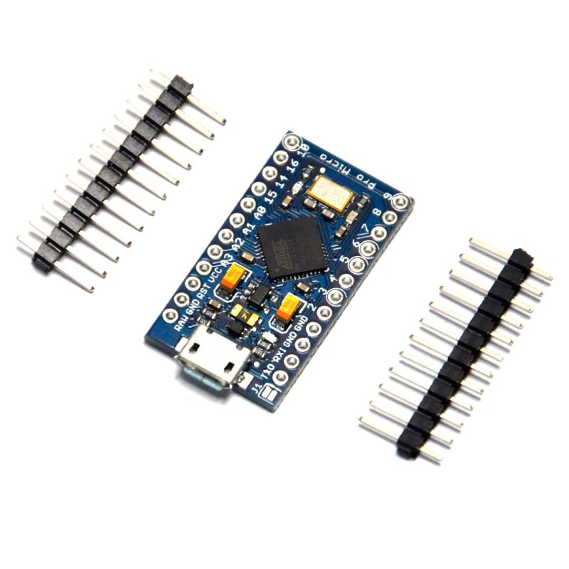

- PS2 Joystick module
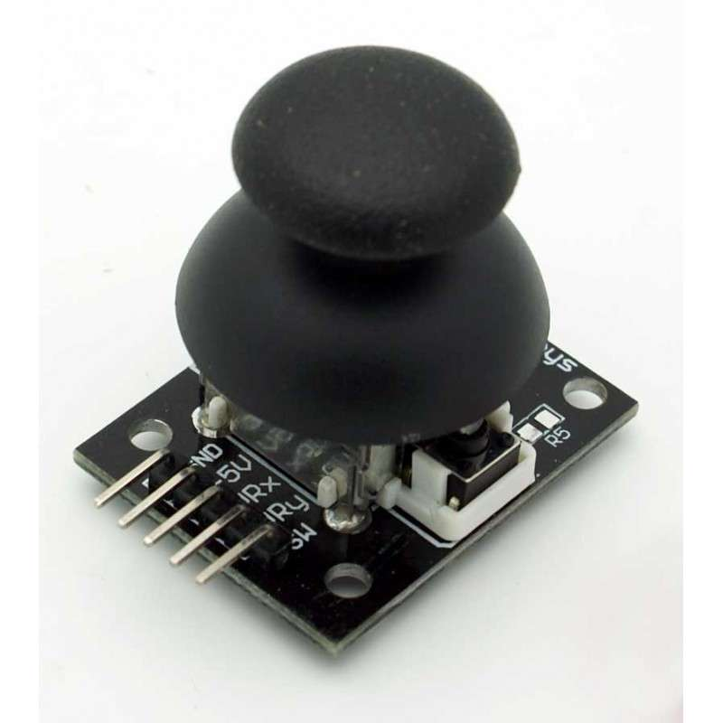
- MX compatible switch
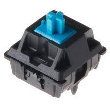
- 6x6x**Y**mm button (I used a 6x6x5mm)
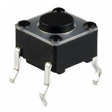
  - Used for resetting the board and making the flash process easier
- Female jumper wires, or regular wire
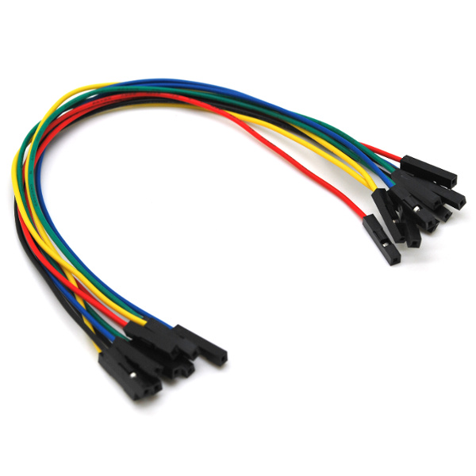

#### Other parts

- 3 x M3 screws for the lid
- 2 x M2 screws? (something to attach the joystick module to the holes)
- Pro micro *compatible* USB cable for flashing and connecting

### 3D printed parts

All stls parts can be found in the **STL** directory

- [Custom Lid](STL/BoxLid.stl)
- [Electronic's Box](STL/ElectronicBox.stl)
- [Joystick module Holder](STL/ElectronicBox.stl)
- [CE3PRO Pro Micro Holder](STL/CE3PRO_ProMicro_Holder.stl), by Pakwaule on [Thingiverse](https://www.thingiverse.com/thing:5793735)

#### Customization

To customize the parts (e.g: change the lid), you can found the **STEP** file used in this directory.

### Pinout

According to this *Pro micro diagram*:
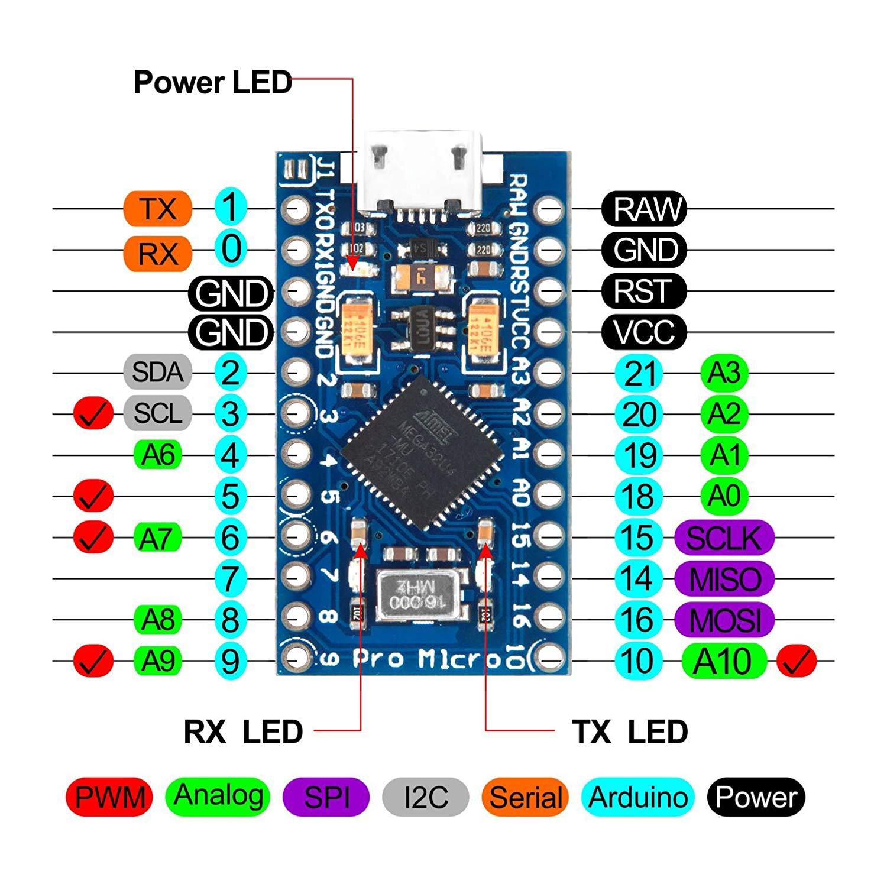
I used the following pinout:
```arduino
const uint8_t Pin_Joystick_X = A0;         // Turn left/right
const uint8_t Pin_Joystick_Y = A1;         // Turn up/down
const uint8_t Pin_Button_Switch = 8;       // Button of the MX Switch
const uint8_t Pin_Button_Joystick = 9;     // Button of the joystick
```

This can be wired as you like, but there are two factors to consider:

1. You must wire the joystick X and Y axes to **Analog** entries on the board (Green entries that start with **A**)
2. The 6x6x**Y** button is hardwired to **GND** and **RST**, to allow easier flashing on the board from the outside


## Software

### Requirements

- [Arduino IDE](https://www.arduino.cc/en/software)
- [Pro Micro board drivers](https://github.com/sparkfun/Arduino_Boards/)
- ***keyboard.h*** library (can be installed from Arduino IDE)

### Installation

To install the custom firmware, you have:

- Open [the arduino file](joystick_keyboard_version/joystick_keyboard_version.ino), in the **IDE**.

- Install the **keyboard.h** library from the *Library Manager*:
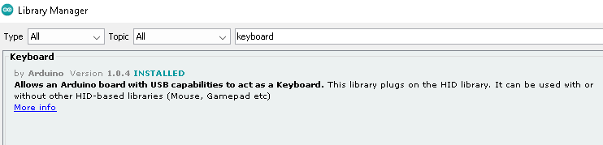
- Install the **Pro micro board drivers**
- Make sure to select the board and processor:
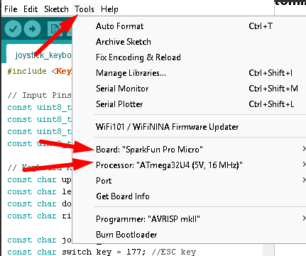
- **Upload** the script via the IDE. While the upload is running, make sure to press the **Reset button** installed in the pinout.


#### Customization

The defaults buttons used in the joystick keyboard are:

```arduino
const char up_key    = 'k';
const char left_key  = 'h';
const char down_key  = 'j';
const char right_key = 'l';

const char joysick_key = 'o';
const char switch_key = 177; //ESC key
```

You can customize them as you like, but you have to **reflash** the board after changes.

